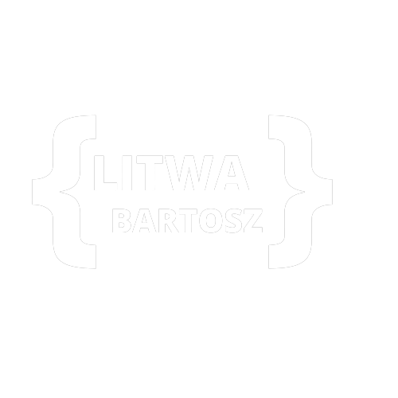
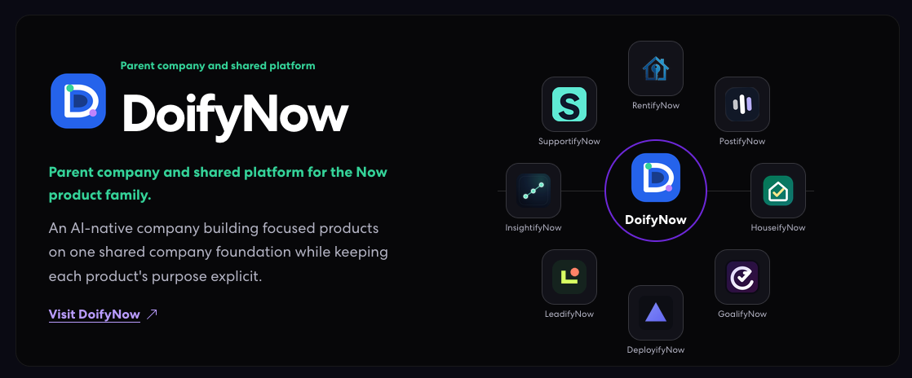

  

  <h1>Building an AI-native company</h1>

  
<strong>Founder-engineer · Warsaw, Poland</strong>

  

    I am building <a href="https://doifynow.com">DoifyNow</a> — a connected family of focused products
    with one shared company direction.
  

  

    <a href="https://litwa.dev">Personal website</a> ·
    <a href="https://www.linkedin.com/in/bartoszlitwa/">LinkedIn</a> ·
    <a href="mailto:bartosz.litwa@proton.me">Email</a>
  

## A new era of building

The work is moving from isolated projects to a connected product system: clear product boundaries,
shared infrastructure, and a deliberate path from idea to build to operation.

DoifyNow is the parent company and shared platform for the **Now product family**. Each product keeps
its own identity and solves a focused problem; together they form one AI-native company in motion.

## The Now product family

  

**Leading the portfolio**

- [RentifyNow](https://rentifynow.com) — rental and property-management workflows · **Active build**
- **PostifyNow** — governed multi-channel content planning, approval, and delivery · **Active build**

**Extending the company system**

- [HouseifyNow](https://houseifynow.com) — homeowner operations, maintenance, and financial oversight · **Building**
- [GoalifyNow](https://goalifynow.com) — goals, habits, fitness, and personal progress · **Building**
- [DeployifyNow](https://deployifynow.com) — deployment and infrastructure automation · **Building**
- [LeadifyNow](https://leadifynow.com) — inbound capture, qualification, booking, and audited handoffs · **Discovery + active construction**
- **InsightifyNow** — governed metrics, lineage, evidence, and decision support · **Discovery + active construction**
- **SupportifyNow** — product-aware customer operations with human-controlled actions · **Discovery + active construction**

Products without public links are intentionally kept in development or discovery until their
destinations are ready.

## What I build

- AI-native company and product systems
- Full-stack web products and SaaS foundations
- Cloud architecture, deployment, and infrastructure workflows
- Evidence-led delivery with .NET, C#, React, Angular, TypeScript, Azure, Azure DevOps, and Docker

## Find me elsewhere

  
  
  

  <em>Focused products. Shared direction. Building what comes next.</em>

